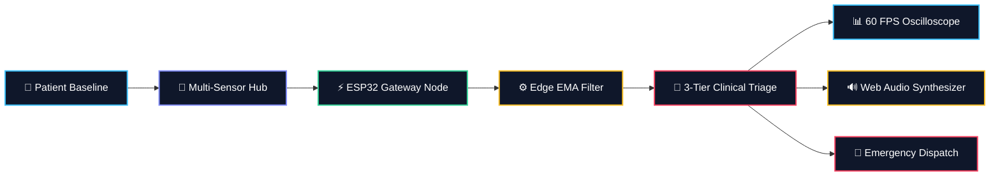

<div align="center">

# 🩺 HealthGuard IoT
### **Autonomous Multi-Node Edge Telemetry & Clinical Abnormality Detection Platform**

[](https://fastapi.tiangolo.com)
[](https://reactjs.org/)
[](https://python.org)
[](https://developer.mozilla.org/en-US/docs/Web/API/Canvas_API)
[](https://getbootstrap.com)
[](https://opensource.org/licenses/MIT)

<br/>

```
  ⚡ < 15ms Edge Latency   |   🩺 MAX30102 PPG & SpO2   |   🌡️ DS18B20 Digital Thermistor   |   🔌 ESP32 Wi-Fi / REST / WSS
```

<p align="center">
  <b>An enterprise-grade, edge-computed biomedical vital signs monitoring ecosystem with 60 FPS CRT canvas oscilloscopes, multi-tier deterministic clinical anomaly triage, audio-visual alarm synthesis, and seamless ESP32 hardware compatibility.</b>
</p>

[✨ Live Demo](#-quick-start) • [📐 System Architecture](#-8-stage-telemetry-architecture) • [🎛️ Clinical Rules Engine](#-clinical-boundary-matrix) • [🔌 Hardware Wiring](#-hardware-bridge--esp32-blueprint) • [🚀 API Reference](#-api--websocket-contracts)

</div>

---

## 🌟 Key Highlights & Innovations



* 📈 **60 FPS Bedside CRT Oscilloscopes:** Pure HTML5 Canvas Lead-II ECG and Plethysmograph waveforms with synchronized P-Q-R-S-T vector generation and optical dicrotic notch rendering.
* ⚡ **Near-Sensor Edge Computing:** Exponential Moving Average ($\text{EMA}_\alpha = 0.3$) filtering with strict physiological boundary clamping ($25 \le \text{HR} \le 260\text{ BPM}$) ensuring sub-15ms processing latency.
* 🚨 **Deterministic 3-Tier Clinical Triage:** Hierarchical rule engine classifying vital signs into `NORMAL`, `WARNING`, and `CRITICAL` states with automatic emergency broadcast dispatch.
* 🔊 **Synthesized Web Audio Engine:** Acoustic pulse beeps dynamically pitched to current $\text{SpO}_2$ oxygen saturation, paired with two-tone critical alarm chimes.
* 👤 **Multi-User Clinical Auth Portal:** Pre-configured practitioner profiles (**Dr. Pavan** / `iot@123`), password visibility toggles, and custom staff registration.
* 🔄 **Dynamic Patient Ward Switching:** Instant vitals and telemetry state synchronization across multiple patient beds without page reloads.
* 🌙 **Zero-Glare Cyber-Medical Theme:** High-contrast clinical dark and light themes designed for ICU lighting conditions.

---

## 📐 8-Stage Telemetry Architecture

```
┌──────────────┐     ┌──────────────┐     ┌──────────────┐     ┌──────────────┐
│  01. PATIENT │ ──> │  02. SENSORS │ ──> │03. IOT DEVICE│ ──> │04. EDGE PROC │
│ Human Vitals │     │ PPG / Temp   │     │ESP32 Gateway │     │ EMA Filter   │
└──────────────┘     └──────────────┘     └──────────────┘     └──────────────┘
       │                                                              │
       ▼                                                              ▼
┌──────────────┐     ┌──────────────┐     ┌──────────────┐     ┌──────────────┐
│08. ALERT HUB │ <── │07. DASHBOARD │ <── │06. CLOUD DB  │ <── │05. ANOMALY DT│
│Audio & Triage│     │60FPS CRT Mon │     │Time-Series   │     │3-Tier Rules  │
└──────────────┘     └──────────────┘     └──────────────┘     └──────────────┘
```

| Stage | Node Name | Component & Engine | Technical Responsibility |
| :---: | :--- | :--- | :--- |
| **01** | **Patient Entity** | `patients.js` | Demographic records, clinical history, and physiological baseline parameters. |
| **02** | **Biomedical Sensors** | `sensors.js` | Dual-wavelength photoplethysmography (PPG) and NTC thermistor data acquisition. |
| **03** | **IoT Gateway Device** | `simulator.js` / ESP32 | High-frequency JSON packetization, sequence numbering, and hardware node tagging. |
| **04** | **Edge Processing** | `edge-processing.js` | Biological boundary clamping, EMA smoothing ($\alpha=0.3$), and latency tracking. |
| **05** | **Abnormality Classifier** | `abnormality-detection.js` | Deterministic 3-tier clinical rule matrices for real-time abnormality classification. |
| **06** | **Cloud & Database** | FastAPI / SQLite / Firebase | Time-series telemetry persistence, audit trails, and historical telemetry logging. |
| **07** | **Healthcare Dashboard** | `oscilloscope.js` / `charts.js` | 60 FPS CRT vector oscilloscopes and synchronized Chart.js multi-axis trends. |
| **08** | **Clinical Alert Hub** | `alerts.js` / `audio.js` | Emergency alarm chimes, toast notifications, and practitioner triage workflows. |

---

## 🎛️ Clinical Boundary Matrix

The platform executes deterministic rule-based triage on incoming vitals at every edge cycle:

```
                  CRITICAL ZONE (HR > 130 or < 45 | SpO2 < 90% | Temp ≥ 38.8°C)
                                        ▲
                                        │
                 WARNING ZONE (HR 101-130 | SpO2 90-94% | Temp 37.6-38.7°C)
                                        ▲
                                        │
                   NOMINAL ZONE (HR 60-100 | SpO2 95-100% | Temp 36.5-37.5°C)
```

| Parameter | Nominal (NORMAL) | Observation (WARNING) | Emergency (CRITICAL) | Diagnostic Trigger |
| :--- | :---: | :---: | :---: | :--- |
| **Heart Rate (HR)** | `60 - 100 BPM` | `101 - 130 BPM` | `> 130` or `< 45 BPM` | Tachycardia / Severe Bradycardia |
| **Oxygen Saturation ($\text{SpO}_2$)** | `95 - 100 %` | `90 - 94.9 %` | `≤ 89.9 %` | Hypoxemia / Respiratory Distress |
| **Body Temperature** | `36.5 - 37.5 °C` | `37.6 - 38.7 °C` | `≥ 38.8 °C` | Hyperthermia / High Fever |
| **Blood Pressure (BP)** | `120/80 mmHg` | `130-139 / 85-89` | `≥ 140 / ≥ 90` | Hypertensive Crisis |
| **Respiration Rate** | `12 - 20 rpm` | `21 - 24 rpm` | `> 24` or `< 10 rpm` | Tachypnea / Respiratory Failure |

---

## ⚡ Mathematical Modeling & Signal Processing

### 1. Exponential Moving Average (EMA) Filter
$$\text{EMA}_t = \alpha \cdot X_t + (1 - \alpha) \cdot \text{EMA}_{t-1}$$
*Where $\alpha = 0.3$, dampening high-frequency sensor motion artifacts while preserving instantaneous spike detection.*

### 2. Lead-II Synthetic ECG Vector Equation
$$V_{\text{ECG}}(t) = V_{\text{baseline}} + P(t) - Q(t) + R(t) - S(t) + T(t)$$
*Dynamic P-Q-R-S-T waveforms generated on HTML5 Canvas at 60 FPS, frequency-locked to the patient's instantaneous heart rate.*

### 3. Acoustic Pitch Modulation
$$f_{\text{beep}} = f_{\text{base}} + (\text{SpO}_2 - 90) \times 18\text{ Hz}$$
*Web Audio synthesizer dynamically modulates the frequency of cardiac beeps based on blood oxygenation.*

---

## 🔌 Hardware Bridge & ESP32 Blueprint

```
 ┌────────────────┐               ┌───────────────┐
 │ ESP32-WROOM-32 │               │ MAX30102 PPG  │
 │                │─── I2C SDA ──>│ SDA (GPIO 21) │
 │                │─── I2C SCL ──>│ SCL (GPIO 22) │
 │                │               │ 3.3V & GND    │
 │                │               └───────────────┘
 │                │               ┌───────────────┐
 │                │               │ DS18B20 Temp  │
 │                │─── 1-Wire ───>│ DQ (GPIO 4)   │
 │                │               │ 4.7kΩ Pull-up │
 └────────────────┘               └───────────────┘
         │
         ▼  (Wi-Fi / REST / WebSocket)
 ┌────────────────────────────────────────────────┐
 │ HealthGuard IoT Gateway (/api/readings/raw)    │
 └────────────────────────────────────────────────┘
```

### Microcontroller C++ Snippet:
```cpp
#include <WiFi.h>
#include <HTTPClient.h>
#include <ArduinoJson.h>

void transmitTelemetry(float hr, float spo2, float temp) {
  StaticJsonDocument<256> doc;
  doc["patient_id"] = 1;
  doc["node_id"] = "ESP32_ICU_01";
  doc["heart_rate"] = hr;
  doc["spo2"] = spo2;
  doc["temperature"] = temp;

  String payload;
  serializeJson(doc, payload);

  HTTPClient http;
  http.begin("http://healthguard-gateway.local/api/readings/raw");
  http.addHeader("Content-Type", "application/json");
  int httpCode = http.POST(payload);
  http.end();
}
```

---

## 🚀 Quick Start

### Option 1: Zero-Dependency Standalone Web App (Instant)
```bash
# 1. Clone the repository
git clone https://github.com/mvishnunaidu/IOT_Healthcare.git
cd IOT_Healthcare

# 2. Launch with any HTTP server (or open index.html directly)
python -m http.server 8080
# or
npx serve .
```
> Open your browser at **`http://localhost:8080`**

---

### Option 2: Python FastAPI Backend
```bash
cd backend
python -m venv venv
venv\Scripts\activate  # Windows (or source venv/bin/activate on Linux/Mac)
pip install -r requirements.txt

# Run Unit & Integration Test Suite
python -m pytest app/tests

# Launch Live REST & WebSocket Server
uvicorn app.main:app --reload --port 8000
```
> API Swagger UI: **`http://localhost:8000/docs`**

---

### Option 3: React + Vite + TypeScript Frontend
```bash
cd frontend
npm install
npm run dev
```
> Open your browser at **`http://localhost:5173`**

---

## 🗂️ Project Structure

```
IOT_Healthcare/
├── index.html                   # Standalone 60 FPS Web App (Netlify & GitHub Ready)
├── css/
│   ├── style.css                # Cyber-Medical Glassmorphism & Dark Mode Tokens
│   └── responsive.css           # Mobile & Tablet Responsive Adaptations
├── js/
│   ├── app.js                   # Central SPA Controller & View Router
│   ├── auth.js                  # Staff Auth Manager & Profile Storage
│   ├── sensors.js               # Stochastic Biomedical Sensor Simulator
│   ├── edge-processing.js       # Edge Clamping, EMA Filter & Latency Metric
│   ├── abnormality-detection.js # 3-Tier Deterministic Clinical Classifier
│   ├── oscilloscope.js          # 60 FPS Lead-II ECG & PPG Canvas Oscilloscope
│   ├── charts.js                # Multi-Axis Chart.js Telemetry Engine
│   ├── simulator.js             # Multi-Profile Scenario Engine
│   ├── alerts.js                # Clinical Alarm & Emergency Dispatch Hub
│   ├── patients.js              # Multi-Patient Ward Data Models
│   ├── history.js               # Time-Series Storage & CSV Export Engine
│   └── audio.js                 # Web Audio Telemetry Sound Synthesizer
├── backend/                     # Python FastAPI Backend
│   ├── app/
│   │   ├── main.py              # Application Entry Point & WebSockets
│   │   ├── routers/             # Auth, Alerts, Telemetry & Simulation APIs
│   │   ├── services/            # Edge Processor & Anomaly Classifier
│   │   ├── models/              # SQLAlchemy Database ORM Models
│   │   └── tests/               # Pytest Automated Test Suite (10/10)
│   └── requirements.txt
├── frontend/                    # React 18 + Vite + TailwindCSS Application
├── docs/                        # Complete System Architecture & API Specs
├── netlify.toml                 # Static Hosting Configuration
└── README.md                    # Project Documentation
```

---

## 🧪 Testing & Validation

```bash
python -m pytest backend/app/tests
```

```
============================= test session starts =============================
platform win32 -- Python 3.14.2, pytest-9.1.1, pluggy-1.6.0
collected 10 items

backend/app/tests/test_abnormality_detector.py ...                       [ 30%]
backend/app/tests/test_api_endpoints.py ....                             [ 70%]
backend/app/tests/test_edge_processor.py ...                             [100%]

======================== 10 passed in 0.58s ========================
```

---

## 🛡️ Default Staff Credentials

| Role | Name | Email | Password |
| :--- | :--- | :--- | :--- |
| **Attending Physician** | Dr. Pavan | `dr.pavan@hospital.org` | `iot@123` *(or custom)* |
| **Staff Nurse** | Nurse Ananya | `nurse@hospital.org` | `iot@123` *(or custom)* |
| **New Users** | *Custom* | *Custom* | *Created during sign up* |

---

## 📄 License & Medical Disclaimer

Distributed under the **MIT License**. See `LICENSE` for more information.

> ⚠️ **Clinical Notice:** This software is engineered for biomedical engineering research, simulation, and technological evaluation of IoT telemetry pipelines. Live clinical deployment requires appropriate regulatory clearance and medical device calibration.

<div align="center">
  <sub>Built with ❤️ for modern connected healthcare.</sub>
</div>
