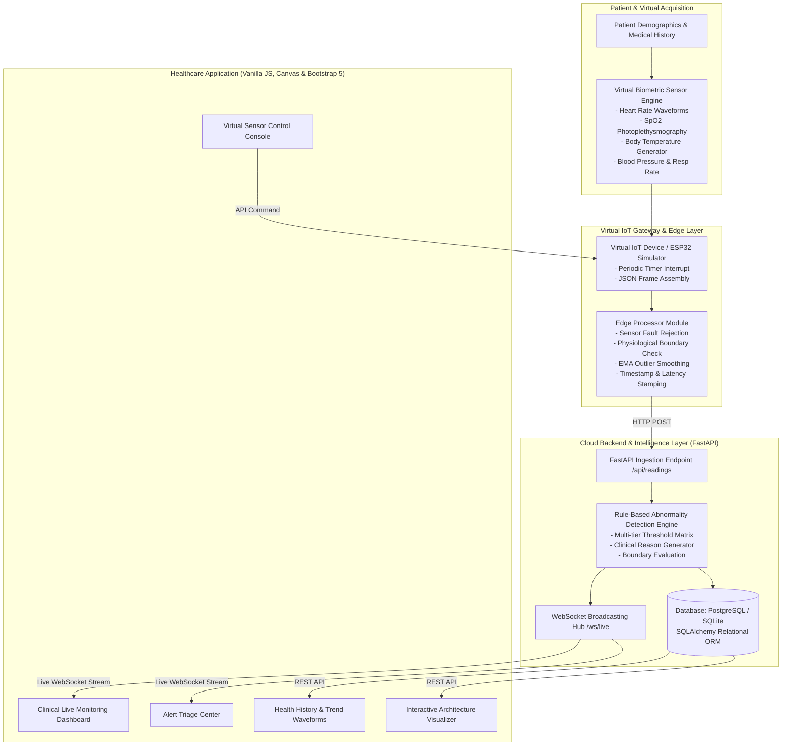

# Detailed System Architecture: IoT Healthcare Monitoring System

## 1. Architectural Diagram

## 2. Component Breakdown

### 2.1 Virtual Sensor Generator
- **Location:** `backend/app/services/simulator_service.py` & `simulator/virtual_device.py`
- **Mechanism:** Generates physiological time series using stochastic random walks and harmonic waveforms ($f(t) = A \sin(\omega t) + \epsilon(t)$).
- **Supported Modes:** `NORMAL`, `WARNING`, `CRITICAL`, `WAVE`, `RANDOM`, `CUSTOM`.

### 2.2 Edge Processor
- **Location:** `backend/app/services/edge_processor.py`
- **Validation Pipeline:**
  1. Data structure & non-null verification.
  2. Range bounds: $25 \le \text{HR} \le 260$, $40 \le \text{SpO}_2 \le 100$, $28^\circ\text{C} \le \text{Temp} \le 45^\circ\text{C}$.
  3. Outlier attenuation: Exponential Moving Average: $\hat{x}_t = \alpha x_t + (1 - \alpha) \hat{x}_{t-1}$.
  4. Signal Quality scoring ($100\% - 15\% \times \text{warnings}$).

### 2.3 Abnormality Detection Engine
- **Location:** `backend/app/services/abnormality_detector.py`
- **Rule Hierarchy:**
  - Evaluates each vital against lower and upper cutoffs.
  - Generates comprehensive human-readable clinical explanations.
  - Dispatches structured alert notifications upon state change.

### 2.4 WebSocket Hub
- **Location:** `backend/app/websocket/connection_manager.py`
- **Protocol:** Real-time bidirectional WebSocket over `/ws/live`.
- **Latency:** Sub-millisecond local event dispatch to active web browsers.
